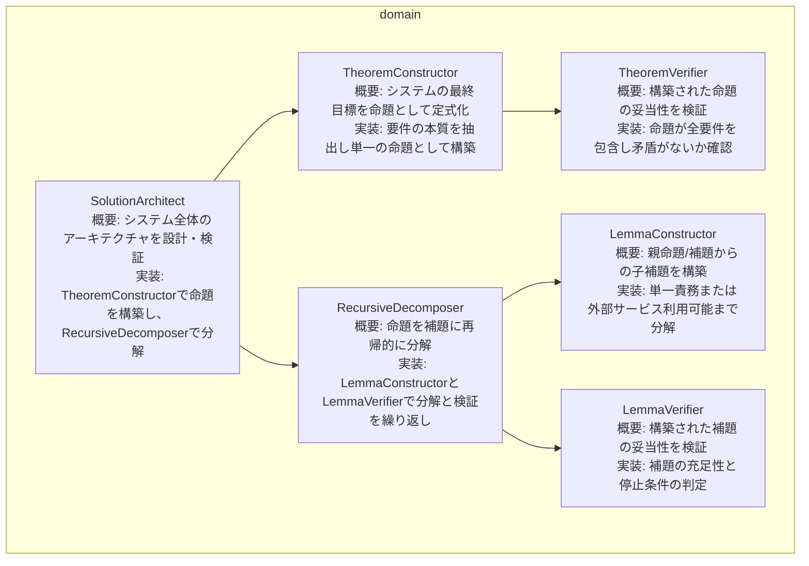

# AGI

```mermaid
graph TD
    subgraph domain
        SolutionArchitect["SolutionArchitect
        概要: システム全体のアーキテクチャを設計・検証
        実装: TheoremConstructorで命題を構築し、RecursiveDecomposerで分解"]
        --> TheoremConstructor
        SolutionArchitect --> RecursiveDecomposer
        
        TheoremConstructor["TheoremConstructor
        概要: システムの最終目標を命題として定式化
        実装: 要件の本質を抽出し単一の命題として構築"]
        --> TheoremVerifier

        TheoremVerifier["TheoremVerifier
        概要: 構築された命題の妥当性を検証
        実装: 命題が全要件を包含し矛盾がないか確認"]

        RecursiveDecomposer["RecursiveDecomposer
        概要: 命題を補題に再帰的に分解
        実装: LemmaConstructorとLemmaVerifierで分解と検証を繰り返し"]
        --> LemmaConstructor
        RecursiveDecomposer --> LemmaVerifier

        LemmaConstructor["LemmaConstructor
        概要: 親命題/補題からの子補題を構築
        実装: 単一責務または外部サービス利用可能まで分解"]

        LemmaVerifier["LemmaVerifier
        概要: 構築された補題の妥当性を検証
        実装: 補題の充足性と停止条件の判定"]
    end
```
