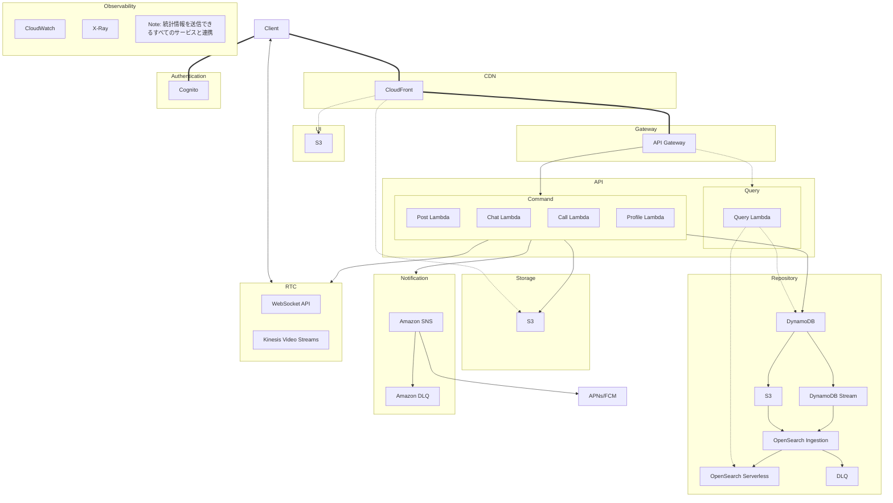

# asyncsns
- awsの一次面接で提出するプロジェクト

# 資料

## ドメイン
- テキストや写真・動画によりユーザの非同期コミュニケーションを実現するSNS
- 主要なSNS機能を全て備える:
  - コンテンツ投稿（動画・写真・音声等）
  - リアルタイムチャット
  - 高度な検索機能
  - プッシュ通知
  - 音声・ビデオ通話

## アーキテクチャ
- AWSマネージドサービスを活用したサーバーレスアーキテクチャを採用
  - インフラ運用の負荷を最小限に抑制
  - 使用量に応じた従量課金でコストを最適化
  - トラフィックに応じた自動スケーリングに対応

### 全体像
- 実線はコマンド
- 破線はクエリ
- 太線はコマンドとクエリの両方
- 双方向やじるしはRTC

### Authentication
- Cognitoを使用
- Cognito ProviderでIAM
- claim発行する、認証・認可
- jwtでやる

### CDN
- ssl証明書管理
- コンテンツのキャッシングと配信
- cloudfrontを使う
- nginxとかcloudflareみたいな感じ

### Gateway
- jwtの検証を行う
- gateway配下のバックエンドでは、jwt検証ロジックを実装しなくていい
- ついでにAPIのバージョン切り替え・負荷対策等
- API Gatewayを使用

### UI
- ウェブサイトの配信
- S3を用いる
- Hosted UIより自作がいい気がする

### API
- Command
    - Lambdaでいろいろ用意する
    - バックグラウンド通知できるようにProduceする
    - バリデーションの後S3にファイルをアップロードする
    - Repositoryにテキストデータを保存する
    - Websocketを確認して直接送るか、SNSにProduceする
- Query
    - dynamoDBに対するクエリをする
    - OpenSearch使って全文検索するLambda
    - ファイル配信はcloudfront -> S3でシンプルにやる

### Repository
- テキストデータの保存
- dynamodb -> dynamodb stream -> opensearch
- zero ETL統合を行う(ノーコードで統合できる)
- s3に初期状態をsnapshotしてinit, 以降はdynamodb streamで同期

### Storage
- S3
- ファイルを保存
- websiteのホスト
- OACを用いてS3からのアクセスのみを許可、期限の設定も可能

### RTC
- プロトコル非依存の抽象化を行い、移行をスムーズに作る
- リアルタイムチャットの配信はWebsocket Apiを使用、awsが対応した場合、webtransportに移行
- DynamoDBで接続情報を管理、要件に応じてElasticCacheで高速化
- webRTCによる会話、ビデオ通話

### Notification
- Amazon SNS + SQSでバックグランド時やTLの通知を管理、LambdaでConsumeして確実に配信

### Observability
- CloudWatch
- X-Ray

## プレゼン

(かっこ内の文章は読まない)

### (ドメインの説明)
- テキストや写真・動画によりユーザーの非同期コミュニケーションを実現するSNSの構成について発表させていただきます
- このSNSは、メディアを含むコンテンツの投稿、リアルタイムチャット、高度な検索、プッシュ通知、通話など、主要なSNS機能をすべて備えています

### (アーキテクチャーの説明)
- アーキテクチャの全体像についてご説明します。
- 図中の実線はmutation等の副作用を持つコマンドの流れを、破線は副作用を持たないリードオンリーなクエリの流れを表しています
- 両方存在する場合は太線で示されています。また、双方向矢印はリアルタイムコミュニケーションのためのコネクションを表します

### (Authentication)
- まず認証についてですが、Cognitoを使用した標準的なJWT形式のトークンによる実装を行います
- フェデレーテッドアイデンティティによるIAMクレデンシャルの発行と、ロールベースのアクセスコントロールを行います

### (CDN)
- CDNではCloudFrontを採用し、ssl証明書の一元管理や、Origin Access Controlポリシーに基づいたS3へのアクセス制御を行います

### (Gateway)
- Gatewayでは、jwtの一元的な検証や、lambdaの呼び出し等を行います。apiバージョンの切り替えや負荷対策なども可能です

### (UI)
- UIはフロントエンドのことで、S3を用いてホストします

### (API)
- APIは、ドメインロジックがまとまっている部分です、Lambdaを使用します
- コマンドを処理するapiでは、投稿、編集、リアルタイムチャット、通話などの処理を行います
    - これらはRepository、Storage、RTC、Notification等のサービスを利用して実現します
    - 例えば投稿では、ファイルをstorageに保存したり、テキストデータをrepositoryに保存したり、友達にNotificationを送ったりします
    - またDMでは、対象の接続がある場合RTC経由でリアルタイムなメッセージ送信を行ったり、通知を送ったりします
- クエリのapiでは、ユーザーが必要とする情報をRepositoryやStorageから取得します
    - 例えば、投稿に対する高度な全文検索や、友達情報の取得などのリレーショナルな検索が可能です

### (Repository)
- Repositoryはテキスト情報の永続化のためのサービスで、dynamodbとopensearchをzero ETL統合して全文検索もできるようにします

### (Storage)
- StorageはS3を使用したファイルの永続化のためのサービスです

### (RTC)
- RTCはリアルタイムチャットのためのサービス群で、awsのwebsocket apiでメッセージを送信したり、stun/turnサーバーを用意してnat超えを行いp2p通話を可能にします

### (Notification)
- Notificationはsns、sqs、lambdaを使用する通知のためのサービスです
- Lambdaに障害が発生しても、後からsqsをconsumeしなおすことで確実な配信を実現します

### (Observability)
- Observabilityはメトリクスやトレーシングを行い、可能なすべてのサービスと連携して、障害時の原因特定やボトルネックの特定、システムの状態管理を行います

### (まとめ)
- 以上により、主要なSNS機能をすべて備えたサービスをAWSマネージドサービスを活用したサーバーレスアーキテクチャで構成しました
- これにより、インフラ運用の負荷を最小限に抑制し、使用量に応じた従量課金でコストを最適化し、トラフィックに応じた自動スケーリングに対応するシステムとなっています

## Q&A
- CloudFrontの機能について
    - エッジキャッシング
    - セキュリティ
        - DDoS保護、WAF、OACによるS3の保護、圧縮、HTTP/3対応
        - アクセスログ解析
- データベースへの書き込みが遅くなるケースの例
    - 投稿がバズった時
- 管理者、開発者、エンドユーザーがそれぞれどのリソースにアクセスするのか
    - 開発者
        - AWS CDKによるインフラストラクチャのデプロイ権限
        - CloudWatchログの閲覧・分析権限
        - テスト環境の全リソースへのフルアクセス
        - 本番環境への制限付きアクセス
    - 管理者
        - AWS Consoleへのアクセス権限
        - ユーザー管理（Cognito）
        - セキュリティ設定の管理
    - エンドユーザー
        - CDN経由でAPIやUIにアクセス
        - 署名付きURLによるS3コンテンツアクセス
        - WebSocket APIへの接続
        - Cognitoによる認証・認可
- api gatewayが停止したらどうなるか
    - フロントエンドは見れる
    - 認証は動く
    - 署名されたファイルのリンクを一時的に持ってるユーザーだけアクセスできる
    - それ以外のすべての機能は動かない
- dynamoDB選定理由
    - auroraとかと迷ったけど、日付の範囲と全文検索とかユースケース考えたらdynamoとopensearchがいいかなと思った
    - 投稿テーブル: パーティションキー=UserID, ソートキー=Timestamp
    - GSIというのがあるらしい
    - デノーマライズ
- なぜs3
    - 業界標準だから
    - 安い
    - マネージド
- lambdaのコールドスタート問題
    - provisioned concurrency機能であっためとく
- 通知システムでのsqs/sns選択理由
    - 
    
### 1. DynamoDBへの書き込みが遅くなるケースとその対策

Q: どのような場合にDynamoDBへの書き込みが遅くなり、それをどう対処しますか？

A: 主に以下のケースが考えられます：

1. ホットパーティション問題
   - 特定のパーティションキーに書き込みが集中する場合
   - 対策：
     - パーティションキーの設計見直し（ユーザーIDに時間要素を付加等）
     - Write Sharding（ランダムサフィックス付加）の実装
     - Adaptive Capacity機能の活用

2. プロビジョニング容量の不足
   - 対策：
     - Auto Scalingの適切な設定
     - On-Demand容量モードの検討
     - CloudWatchメトリクスによる早期検知

3. 大量の同時書き込み
   - 対策：
     - SQSによる書き込みのバッファリング
     - BatchWriteItemの活用
     - 書き込みの分散化

### 2. DynamoDBを選択した理由

Q: なぜRDBMSではなくDynamoDBを選択したのですか？

A: 以下の理由から選択しました：

1. スケーラビリティ
   - SNSの特性上、データ量が予測不能
   - サーバーレスアーキテクチャとの親和性
   - Auto Scaling機能による柔軟な対応

2. パフォーマンス
   - 一貫した低レイテンシー（シングルミリ秒）
   - グローバルテーブルによる地理的分散
   - インデックス設計の柔軟性

3. コスト最適化
   - 使用量に応じた課金
   - プロビジョニングの柔軟な調整
   - 運用コストの削減

### その他の想定質問と回答

1. データモデリング関連

Q: DynamoDBでのSNSデータモデリングの具体的な設計について説明してください。

A:
- 投稿テーブル：パーティションキー=UserID、ソートキー=Timestamp
- タイムラインテーブル：パーティションキー=UserID、ソートキー=Timestamp
- GSIを活用したアクセスパターン最適化
- デノーマライズによる読み取り効率化

2. 一貫性関連

Q: Eventually Consistentな特性がSNSにもたらす影響とその対策は？

A:
- タイムライン更新の遅延許容
- Strong Consistencyが必要な操作の識別
- 重要な操作での一貫性レベルの選択
- バージョニングによる矛盾解決

3. バックアップと災害対策

Q: データの永続性と可用性をどのように確保していますか？

A:
- Point-in-time Recovery (PITR)の活用
- グローバルテーブルによる地理的冗長性
- バックアップの自動化とテスト
- 障害シナリオの定期的な検証

4. 監視とパフォーマンスチューニング

Q: システムのパフォーマンスをどのように監視・最適化していますか？

A:
- CloudWatchメトリクスの活用
- X-Rayによるトレーシング
- キャパシティプランニングの定期的な見直し
- ホットパーティションの検知と対応

5. コスト最適化

Q: DynamoDBのコストを最適化するための戦略は？

A:
- 適切なキャパシティモードの選択
- TTLによる不要データの自動削除
- リザーブドキャパシティの活用
- アクセスパターンに基づくインデックス設計

これらの質問に対して、具体的な実装例や数値を交えながら説明することで、技術的な理解の深さを示すことができます。また、実際の運用経験やトラブルシューティングの経験があれば、それらも交えて説明するとより説得力が増すでしょう。

## Note
- APIがCQRSによって二つに分類される
- 図はコマンドに焦点あてて書いてる
- Queryの場合、Lambda不要になる部分がある
    - opensearchやs3は直接データ読みに行く
    - lambdaのconsumerでsqsをconsumeして通知を配信する(queryかどうかも怪しい)
- 図を書く (まとめの役割)
- api gatewayやx-ray等の、複数にまたがるサービスから順に、広いほうから説明
- ドメインから考えていく、各ドメインは自身のコンテキストに集中できるよう、カプセル化された説明
- 抽象的な説明 -> 具体や詳細 -> まとめで抽象に戻る (qiskitの説明動画のやり方参考にする)

## refs
- [chat application](https://aws.amazon.com/jp/blogs/news/building-a-full-stack-chat-application-with-aws-and-nextjs/)
- [localstack](https://docs.docker.com/guides/localstack/)
- [aws cdk local](https://github.com/localstack/aws-cdk-local?tab=readme-ov-file)
- [oac](https://qiita.com/shota_hagiwara/items/caacbda7f55aeea110d1)
- [ライブ配信](https://docs.aws.amazon.com/ja_jp/ivs/latest/RealTimeUserGuide/obs-whip-support.html)
- [DB比較](https://dynobase.dev/dynamodb-vs-aurora/)
- [CloudFront](https://aws.amazon.com/blogs/aws/new-http-3-support-for-amazon-cloudfront/)
- [provisioned concurrency](https://dev.classmethod.jp/articles/lambda-provisioned-concurrency-coldstart/)
- [provisioned concurrency cost](https://dev.classmethod.jp/articles/simulate-provisioned-concurrency-cost/)
- [amazon sns](https://docs.aws.amazon.com/sns/latest/dg/welcome.html)
- [dynamodb opensearch](https://qiita.com/Yodeee/items/415b11e0e886ec93ec8a)
- [dynamodb opensearch official](https://docs.aws.amazon.com/amazondynamodb/latest/developerguide/OpenSearchIngestionForDynamoDB.html)
- [opensearch](https://docs.aws.amazon.com/opensearch-service/latest/developerguide/configure-client-ddb.html)
- [opensearch serverless](https://qiita.com/neruneruo/items/d4dd391147e0af709d4e)
- [zero etl](https://aws.amazon.com/jp/what-is/zero-etl/)
- [amazon sns dlq](https://docs.aws.amazon.com/sns/latest/dg/sns-dead-letter-queues.html)
- [webrtc amazon](https://docs.aws.amazon.com/kinesisvideostreams-webrtc-dg/latest/devguide/what-is-kvswebrtc.html)
- [amazon kinesis video streams](https://docs.aws.amazon.com/kinesisvideostreams/latest/dg/what-is-kinesis-video.html)
