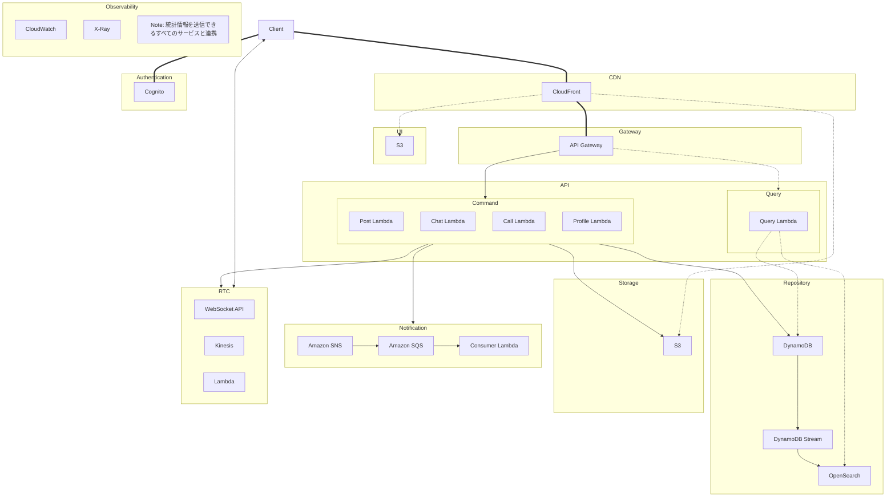

# asyncsns
- awsの一次面接で提出するプロジェクト

# 資料

## ドメイン
- テキストや写真・動画によりユーザの非同期コミュニケーションを実現するSNS
- 主要なSNS機能を全て備える:
  - コンテンツ投稿（動画・写真・音声等）
  - リアルタイムチャット
  - 高度な検索機能
  - プッシュ通知
  - 音声・ビデオ通話

## アーキテクチャ
- AWSマネージドサービスを活用したサーバーレスアーキテクチャを採用
  - インフラ運用の負荷を最小限に抑制
  - 使用量に応じた従量課金でコストを最適化
  - トラフィックに応じた自動スケーリングに対応

### 全体像
- 実線はコマンド
- 破線はクエリ
- 太線はコマンドとクエリの両方
- 双方向やじるしはRTC

### Authentication
- Cognitoを使用
- Cognito ProviderでIAM
- claim発行する、認証・認可
- jwtでやる

### CDN
- ssl証明書管理
- コンテンツのキャッシングと配信
- cloudfrontを使う
- nginxとかcloudflareみたいな感じ

### Gateway
- jwtの検証を行う
- gateway配下のバックエンドでは、jwt検証ロジックを実装しなくていい
- ついでにAPIのバージョン切り替え・負荷対策等
- API Gatewayを使用

### UI
- ウェブサイトの配信
- S3を用いる
- Hosted UIより自作がいい気がする

### API
- Command
    - Lambdaでいろいろ用意する
    - バックグラウンド通知できるようにProduceする
    - バリデーションの後S3にファイルをアップロードする
    - Repositoryにテキストデータを保存する
    - Websocketを確認して直接送るか、SNSにProduceする
- Query
    - dynamoDBに対するクエリをする
    - OpenSearch使って全文検索するLambda
    - ファイル配信はcloudfront -> S3でシンプルにやる

### Repository
- テキストデータの保存
- dynamodb -> dynamodb stream -> opensearch

### Storage
- S3
- ファイルを保存
- websiteのホスト
- OACを用いてS3からのアクセスのみを許可、期限の設定も可能

### RTC
- プロトコル非依存の抽象化を行い、移行をスムーズに作る
- リアルタイムチャットの配信はWebsocket Apiを使用、awsが対応した場合、webtransportに移行
- DynamoDBで接続情報を管理、要件に応じてElasticCacheで高速化
- webRTCによる会話、ビデオ通話

### Notification
- Amazon SNS + SQSでバックグランド時やTLの通知を管理、LambdaでConsumeして確実に配信

### Observability
- CloudWatch
- X-Ray

## プレゼン

(かっこ内の文章は読まない)

### (ドメインの説明)
- テキストや写真・動画によりユーザーの非同期コミュニケーションを実現するSNSの構成について発表します。
- 主要なSNS機能をすべて備えます。
- 動画写真音声等のコンテンツ投稿、リアルタイムチャット、高度な検索、プッシュ通知、音声・ビデオ通話等です。

### (アーキテクチャーの説明)
- アーキテクチャの全体像は以下の通りです
- 実線はコマンドの流れです、mutation等の副作用を持つ処理の流れです。
- 破線はクエリの流れです、副作用を持たない、リードオンリーな処理の流れです。
- 両方存在する経路は太線になっています。
- 双方向やじるしはRTC: Real Time Communicationのための双方向コネクションです。

### (Authentication)
- Authenticationでは、Cognitoを使用して認証・認可を行います。
- IAMによるアクセスコントロールを行います。
- jwtを使用します。

### (CDN)
- CDNは、CloudFrontを用いて、ssl証明書の一元管理やOAC: Origin Access Controlポリシーに基づいたS3のアクセス制御を行います。

### (Gateway)
- Gatewayでは、jwtの一元的な検証や、lambdaの呼び出し等を行います。apiバージョンの切り替えや負荷対策等も行うことが可能です。

### (UI)
- UIは、フロントエンドのことで、S3を用いてホストします。

### (API)
- APIは、ドメインロジックがまとまっている部分です、Lambdaを使用します。
- コマンドを処理するapiでは、投稿、編集、リアルタイムチャット、通話などの処理を行います。
    - Repository、Storage、RTC、Notification等のサービスを用いて行います
    - <!-- TODO: ポストの投稿での具体例(ファイルはstorageへ) -->
    - <!-- TODO: リアルタイムチャットでの具体例(bg,fgの通知戦略) -->
- クエリのapiでは、ユーザーが必要とする情報を取得できます。
    - RepositoryやStorageを使用します。
    - 例えば、投稿に対しての高度な全文検索を行うことができます。
    - 当然、友達情報の取得等のリレーショナルな検索も可能です。

### (Repository)
- Repositoryはテキスト情報の永続化のためのサービスです。
- dynamodbのデータをdynamodb streamでリアルタイムにexportしてopensearchで検索ができるようにします。

### (Storage)
- Storageはファイルの永続化のためのサービスです。
- S3を使用します。

### (RTC)
- RTCはリアルタイムチャットのためのサービス群です。
- awsのwebsocket apiを使用してメッセージを送信したり、stun/turnを使ってnat超えを行い擬似p2p通話を可能にしたりします。

### (Notification)
- Notificationは通知のためのサービスで、snsとsqsとlambdaを使用します。
- 問題が発生しても、後からconsumeしなおすことで確実に配信を行います。

### (Observability)
- Observabilityはメトリクスやトレーシングを行います、これは可能なすべてのサービスと連携して、障害時の原因特定やボトルネックの特定、システムの状態管理を行います。

## Q&A
- CloudFrontの機能について
    - エッジキャッシング
    - セキュリティ
        - DDoS保護、WAF、OACによるS3の保護、圧縮、HTTP/3対応
        - アクセスログ解析
- データベースへの書き込みが遅くなるケースの例
- 管理者、開発者、エンドユーザーがそれぞれどのリソースにアクセスするのか
    - 開発者
        - AWS CDKによるインフラストラクチャのデプロイ権限
        - CloudWatchログの閲覧・分析権限
        - テスト環境の全リソースへのフルアクセス
        - 本番環境への制限付きアクセス
    - 管理者
        - AWS Consoleへのアクセス権限
        - ユーザー管理（Cognito）
        - セキュリティ設定の管理
    - エンドユーザー
        - CDN経由でAPIやUIにアクセス
        - 署名付きURLによるS3コンテンツアクセス
        - WebSocket APIへの接続
        - Cognitoによる認証・認可
- api gatewayが停止したらどうなるか
    - フロントエンドは見れる
    - 認証は動く
    - 署名されたファイルのリンクを一時的に持ってるユーザーだけアクセスできる
    - それ以外のすべての機能は動かない

## Note
- APIがCQRSによって二つに分類される
- 図はコマンドに焦点あてて書いてる
- Queryの場合、Lambda不要になる部分がある
    - opensearchやs3は直接データ読みに行く
    - lambdaのconsumerでsqsをconsumeして通知を配信する(queryかどうかも怪しい)
- 図を書く (まとめの役割)
- api gatewayやx-ray等の、複数にまたがるサービスから順に、広いほうから説明
- ドメインから考えていく、各ドメインは自身のコンテキストに集中できるよう、カプセル化された説明
- 抽象的な説明 -> 具体や詳細 -> まとめで抽象に戻る (qiskitの説明動画のやり方参考にする)

## refs
- [chat application](https://aws.amazon.com/jp/blogs/news/building-a-full-stack-chat-application-with-aws-and-nextjs/)
- [localstack](https://docs.docker.com/guides/localstack/)
- [aws cdk local](https://github.com/localstack/aws-cdk-local?tab=readme-ov-file)
- [oac](https://qiita.com/shota_hagiwara/items/caacbda7f55aeea110d1)
- [ライブ配信](https://docs.aws.amazon.com/ja_jp/ivs/latest/RealTimeUserGuide/obs-whip-support.html)
