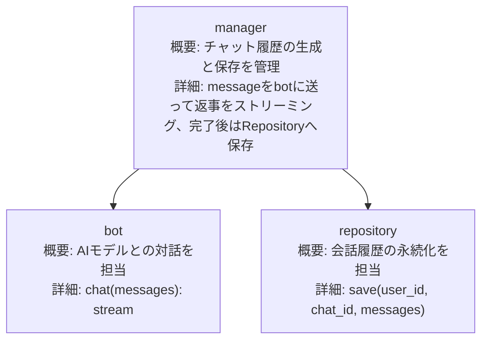

# ChatHub
- open-webui等のpipeline書く
- 会話した内容をそのままgitで管理
- 実質リッチなイベントストアなので後からなんぼでも分析できる

## 構成図

## 仕様
- 一つ一つの会話は長さ制限もあるし、丸ごと扱って問題ない
- Gitリポジトリ作ってそこにファイル作って新しい会話やお喋りはコミットすればいい
- ファイルとしてjsonで全部残してる、会話に対して全文検索などなんでもできる、再生もできる
- ついでにイベントとして新しいファイルをリードモデルとかにproduceすればおk
    - どうせaiも毎回すべての会話を送信する必要ある
- ファイル自体は差分管理しない、リポジトリ全体はファイル単位で差分管理される、これはGitと全く同じ
- 任意のintegrationを行いたい、わけわからんフレームワークではなく、redpandaでイベントドリブンにしたい
    - 会話の内容が丸ごとイベントとしてproduceされる
    - 返事はリアルタイムで受け取りたかったりするので非同期じゃなくて同期である必要が部分的にある
    - とりあえずroleとcontentの範囲内で、イベントドリブンは非同期だから結果がいつ来るかわからないけど、それはredpandaをconsumeすればいい
    - ragしてaiに聞いて別のaiが判定してまたragする、といった処理について
        - 全部非同期になっていて、consumeすることで、どのroleが何したか、終わった時にproduceされるイベントから分かる
- やっぱりイベントドリブンはragのような同期的なユースケースに向いてな気がする
    - 言語を変えるならワンチ必要があるが、全部pythonで書けるし、それだとサービス分ける意味特にない
    - 同じプログラムからproduceしてconsumeしたら一人キャッチボールみがある
    - イベントドリブンは、バッチ処理などに向いてそうではある

## Memo
- pipelineでのimportはsys.pathで乗り切る
