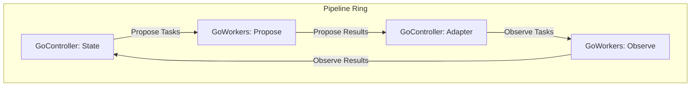

# Introduction

In Go's Communicating Sequential Processes (CSP) model, managing the lifecycle of goroutines requires boilerplate implementation to avoid issues like deadlocks, synchronize state, and ensure a graceful shutdown. This package provides composable primitives that encapsulate these concerns, allowing developers to focus on application logic.

# Overview

This package provides three components to build concurrent data pipelines. These pipelines are modeled on a "ring architecture," where data circulates through channels connecting the different processing stages.

*   **`GoController`**: A synchronous component running on a single goroutine for state management and task distribution.
*   **`GoWorkers`**: An asynchronous component that executes tasks in parallel across multiple goroutines.
*   **`Ring`**: A container that manages the lifecycle of the entire pipeline, including its creation, execution, and termination.
*   **`Pipeline Shutdown`**: The process for safely terminating the pipeline, which can be initiated as a **Graceful Shutdown** or a **Forced Shutdown**.

The components connect via channels to form a pipeline, as illustrated below.



# GoController

A `GoController` handles synchronous processing, such as state management. It runs on a single internal goroutine, which allows it to manage state safely without locks. It continuously attempts to send the next available task while also listening for incoming results, making it responsive to both sides of the pipeline.

The controller's behavior is defined by two callback functions:
*   `onResult`: Processes an incoming result, updates state, and can signal that the controller's work is complete.
*   `onNext`: Returns the next task to be dispatched.

This design isolates state access to a single goroutine, which simplifies complex state transitions and eliminates race conditions. The controller will only call `onNext` when it is ready to send a new task (i.e., after the previous task has been sent), and it will disable sending if `onNext` indicates that no task is currently available.

# GoWorkers

A `GoWorkers` component manages a group of worker goroutines to execute a function in parallel. It is designed for asynchronous, stateless tasks where parallelization can increase throughput, such as I/O or computationally intensive operations.

It receives tasks from an input channel (`reqCh`), executes the provided task function (`taskFn`), and sends results to an output channel (`resCh`). The number of concurrent goroutines is configurable. When all tasks are complete, or the pipeline is shut down, `GoWorkers` closes its output channel.

# Ring

The `Ring` manages the lifecycle of all pipeline components. It uses a `context` for cancellation and a `sync.WaitGroup` to ensure all goroutines terminate gracefully.

### Usage

1.  Create a `Ring` from a `context` with `pipeline.NewRing(ctx)`.
2.  Pass the `Ring` instance to all `GoController` and `GoWorkers` components when they are created.
3.  Call `ring.Wait()` to block until all pipeline goroutines have terminated.

```go
ctx, cancel := context.WithCancel(context.Background())
defer cancel() // Ensure context is always cancelled for cleanup.

ring := pipeline.NewRing(ctx)

// Instantiate and start GoWorkers and GoController components with the ring.

// The pipeline runs until a shutdown is initiated.

ring.Wait()  // Blocks until all goroutines have finished.
```

# Pipeline Shutdown

Termination of the pipeline can be triggered in two ways: a graceful shutdown initiated by a component or a forced shutdown initiated by context cancellation.

## Graceful Shutdown

A graceful shutdown is initiated by a `GoController` when its work is complete.

1.  The `onResult` callback in a `GoController` returns `true`, signaling it is finished.
2.  The controller closes its output channel (`reqCh`). This signals to the downstream component that no more tasks will be sent.
3.  The controller then drains its input channel (`resCh`), receiving and discarding any in-flight results until the channel is closed by the upstream component.
4.  Downstream components detect the closed input channel and finish their current work.
5.  Once all workers in a `GoWorkers` stage are done, it closes its output channel.
6.  This closure propagates through the pipeline, causing each component to shut down in sequence.
7.  `ring.Wait()` unblocks after all component goroutines have terminated.

## Forced Shutdown

A forced shutdown is initiated by canceling the `context` supplied to the `Ring`.

1.  The `context` passed to `NewRing` is canceled.
2.  The `context.Done()` channel is closed.
3.  All `GoController` and `GoWorkers` goroutines are selecting on this channel. The case for `<-r.Ctx.Done()` is selected.
4.  Each goroutine immediately returns, terminating its execution.