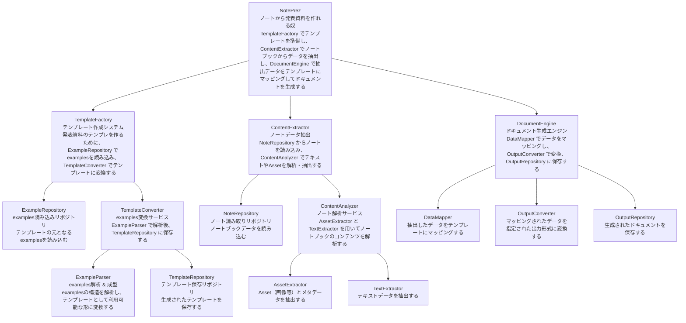

# NotePrez
自動で発表資料の体裁に合わせたい

## ドメイン構成図

```mermaid
graph TD
    A[NotePrez<br>ノートから発表資料を作れる奴<br>TemplateFactory でテンプレートを準備し、ContentExtractor でノートブックからデータを抽出し、DocumentEngine で抽出データをテンプレートにマッピングしてドキュメントを生成する] --> B[TemplateFactory<br>テンプレート作成システム<br>発表資料のテンプレを作るために、ExampleRepository でexamplesを読み込み、TemplateConverter でテンプレートに変換する];
    A --> E[ContentExtractor<br>ノートデータ抽出<br>NoteRepository からノートを読み込み、ContentAnalyzer でテキストやAssetを解析・抽出する];
    A --> L[DocumentEngine<br>ドキュメント生成エンジン<br>DataMapper でデータをマッピングし、OutputConverter で変換、OutputRepository に保存する];

    B --> C[ExampleRepository<br>examples読み込みリポジトリ<br>テンプレートの元となるexamplesを読み込む];
    B --> D[TemplateConverter<br>examples変換サービス<br>ExampleParser で解析後、TemplateRepository に保存する];

    D --> F[ExampleParser<br>examples解析 & 成型<br>examplesの構造を解析し、テンプレートとして利用可能な形に変換する];
    D --> G[TemplateRepository<br>テンプレート保存リポジトリ<br>生成されたテンプレートを保存する];
    
    E --> H[NoteRepository<br>ノート読み取りリポジトリ<br>ノートブックデータを読み込む];
    E --> I[ContentAnalyzer<br>ノート解析サービス<br>AssetExtractor と TextExtractor を用いてノートブックのコンテンツを解析する];
    
    I --> J[AssetExtractor<br>Asset（画像等）とメタデータを抽出する];
    I --> K[TextExtractor<br>テキストデータを抽出する];
    
    L --> M[DataMapper<br>抽出したデータをテンプレートにマッピングする];
    L --> N[OutputConverter<br>マッピングされたデータを指定された出力形式に変換する];
    L --> O[OutputRepository<br>生成されたドキュメントを保存する];
```
