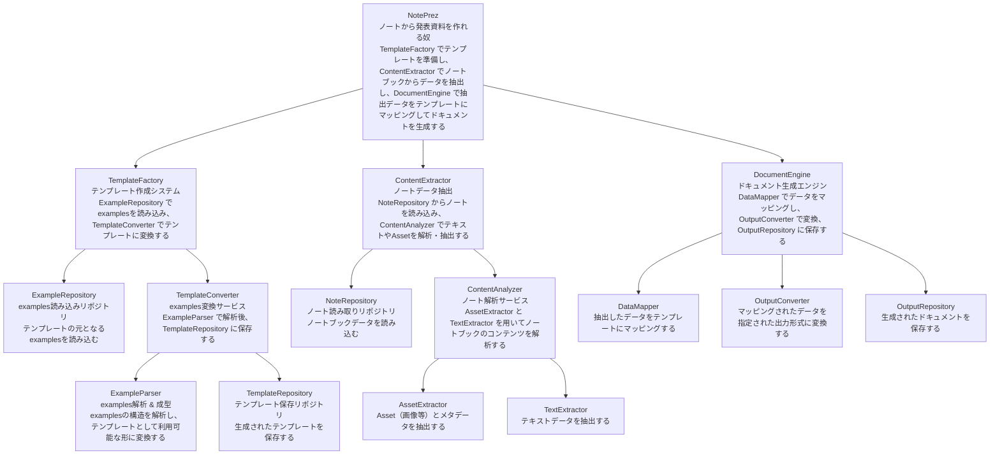

# インデックス処理

## Context
jupyter notebookからワードファイルに変換したい
テンプレートがあって、その通りのワードファイルにしたい
マークダウンの個々の内容をテンプレートの書く要素に当てはめる必要がある
画像データとかを自動抽出できればとてもうれしい
キャプションの書き方にも指定がある
出力結果は自動でteamsにアップロードしたい

## Graph (ボトムアップ)
1. ファイルの変換、テンプレートがある、アセットがついてる、アセットのメタデータもある
2. 普通のテキスト、アセット、アセットのメタデータをテンプレートに従って構成する
3. ノートから、発表資料を作ってくれる奴: NotePrez

# Solution Architect

Human:
"ノートから、発表資料を作ってくれる奴" という大きなテーマを、より細かい補題に分けたい
分け方は無限に考えられるが、Contextを参考にしていい感じの分け方にしたい
ドメインを、2~5個程度のより考えやすい補題に分けてください

You:
- "ノートから、発表資料を作ってくれる奴"
  - テンプレート作成システム
  - ノートブックからテキスト、画像、メタデータを抽出
  - ドキュメント生成エンジン

Human:
Contextも参考にしながら、"ノートブックからテキスト、画像、メタデータを抽出"に集中して、さらに補題への分解を行ってください
Jupyter等の実装依存用語は使用禁止です

You:
- "ノートから、発表資料を作ってくれる奴"
  - テンプレート作成システム
  - ノートブックからテキスト、画像、メタデータを抽出
    - リポジトリサービス (読み取り用)
    - 解析サービス
      - 画像とメタデータの抽出
      - テキストの抽出
  - ドキュメント生成エンジン
    
Human:
同様にして、"テンプレート作成システム"と"ドキュメント生成エンジン"に対しても、同様にして再帰的な補題への分解を行ってください

You:
- "ノートから、発表資料を作ってくれる奴"
  - テンプレート作成システム
    - examplesを読み込むためのリポジトリサービス
    - examplesをテンプレートに変換するサービス
      - examplesの解析 & 成型
      - 綺麗なテンプレートになったらそれを保存するリポジトリサービス
  - ノートブックからテキスト、画像、メタデータを抽出
    - リポジトリサービス (読み取り用)
    - 解析サービス
      - 画像とメタデータの抽出
      - テキストの抽出
  - ドキュメント生成エンジン
    - 抽出したデータをテンプレートにマッピングするサービス
    - マッピングされたデータから出力への変換サービス
    - 出力を保存するリポジトリ

