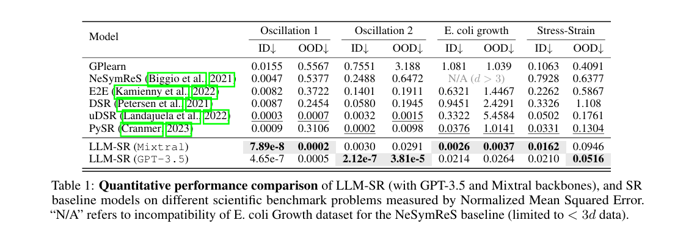
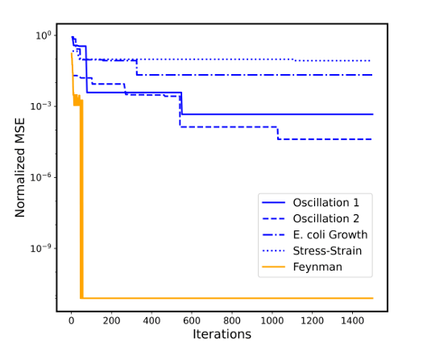

# oscillator2

## どの部分に着目してどのような検証を行ったか

* **着目した点**: geminiのファインチューニング試そうかなと思い、課金して発見だけやってみた、これだけ結果が微妙だったのでやり直した
* **行った実装**: Gemini 2.0 Flashで8スレッドに設定して探索した
* **何が明確になったか**: 37回目で誤差超少ない関数発見した、かかった時間27秒、最初からgemini使えばよかったと大後悔している

## 発見された関数
```python
def equation_v2(t: np.ndarray, x: np.ndarray, v: np.ndarray, params: np.ndarray) -> np.ndarray:
    dv = params[0] * np.sin(t) - params[1] * x - params[2] * v + params[3] * x**2 - params[4] * v**3 + params[5] * np.sin(params[6] * t) - params[7] * x * v + params[8] * np.cos(params[9] * t)
    return dv
```

## 誤差表

### 今回
| Dataset | Loss Value                |
|---------|---------------------------|
| train   | -2.93944738486453e-07     |
| id      | -2.9072206012472963e-07   |
| ood     | -7.753452735320866e-05    |

### 先行研究
#### oodとid

#### train


## 考察
こんなすぐ見つかるなら最初からgeminiでやるべきだった...

mutationよりevaluateの方がボトルネックであることがわかった

12回目で誤差e-06オーダーの式見つけてる
