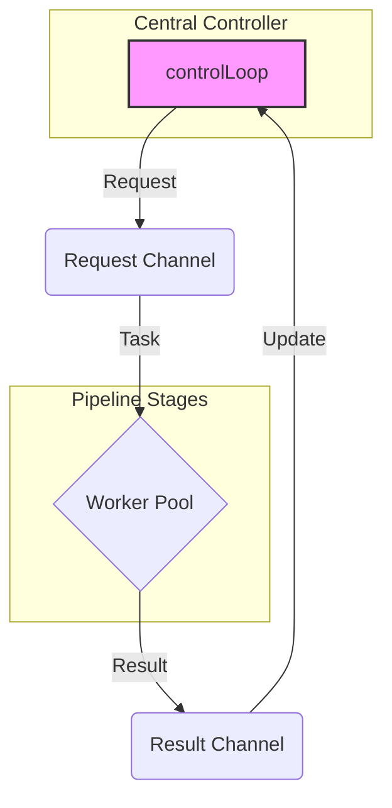

# `parpipe`: A Proof-of-Concept for Pipelined Parallel Evolutionary Algorithms

This directory contains a Proof-of-Concept (PoC) implementation of a parallel evolutionary algorithm using Go's concurrency primitives (CSP). It demonstrates an event-driven architecture with centralized state management, designed for scalability and fault tolerance (e.g., suspend and resume).

## Abstract

This PoC explores a pipeline parallelization model for island-based Genetic Algorithms (GA). The core idea is to separate the state management from the computational workers. A central `controlLoop` manages the entire state of the simulation, while stateless workers execute tasks in parallel. This design simplifies complex operations like state serialization for suspend/resume features, which is crucial for long-running tasks like training Large Language Models (LLMs).

## Architecture

The system consists of three main components:

1.  **`State`**: A single struct that holds the entire state of the GA, including all islands, populations, and the global best individual.
2.  **`workerPool`**: A generic pool of stateless workers that execute pure functions (e.g., selection, crossover, mutation, evaluation). They receive tasks via channels and send results back.
3.  **`controlLoop`**: An event-driven loop that acts as the central controller. It reads the current `State`, dispatches tasks to the worker pools (`dispatch` logic), receives results, and updates the `State` accordingly (`propagate` logic).

The control flow is as follows:

## Key Features

-   **Centralized State Management**: Simplifies saving and restoring the application state.
-   **Stateless Workers**: Workers are decoupled and easy to test, replace, or scale.
-   **Flexibility**: The `dispatch` and `propagate` logic can be modified to simulate various algorithms, such as synchronous/asynchronous island models or even Monte Carlo Tree Search (MCTS), without changing the worker implementation.
