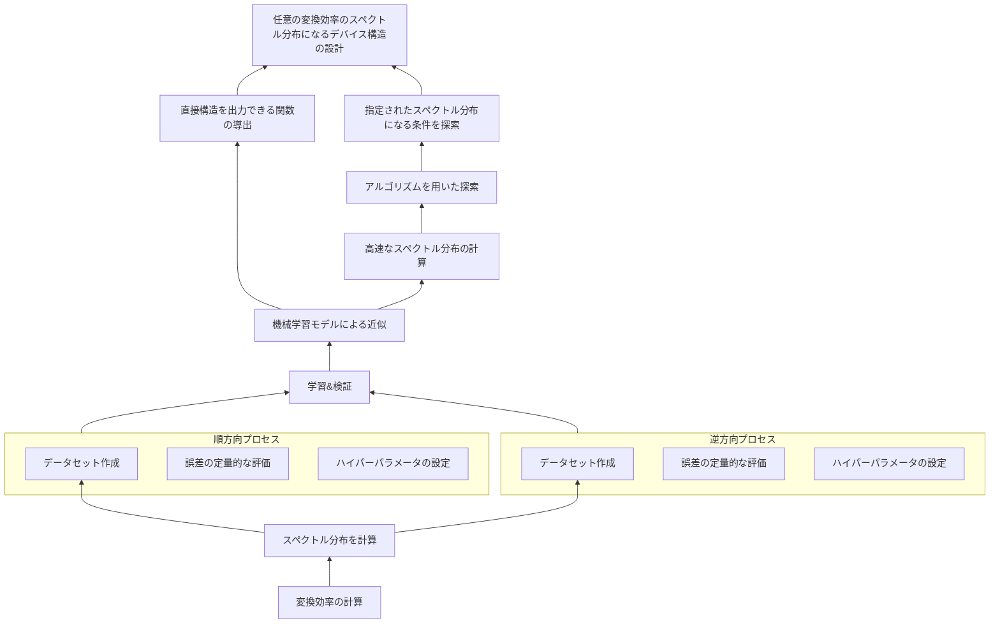

# 導入

任意の変換効率のスペクトル分布を計算したい理由

# 目次

# 任意の変換効率のスペクトル分布になるデバイス構造の設計

## 概要
欲しいスペクトル分布になるような、縦型擬似位相整合デバイスにおける分極反転幅の配列を計算します。

* Example 1:
    * Input: <縦軸を変換効率、横軸を波長としたグラフをプロットするためのデータと図>
    * Output: <一定周期幅配列>

* Example 2:
    * Input: <縦軸を変換効率、横軸を波長としたグラフをプロットするためのデータと図>
    * Output: <チャープした周期配列>

## 詳細
直接条件を出力できる関数を導出するか、指定されたスペクトル分布になる条件を探索することができれば設計できます。
    
* Subdomains
    * 指定されたスペクトル分布になる条件を探索
    * 直接条件を出力できる関数を導出

# 直接条件を出力できる関数の導出

## 概要
スペクトル分布を入力として、幅配列を出力とするような関数を作ります。

* Example 1:
    * Input: <縦軸を変換効率、横軸を波長としたグラフをプロットするためのデータと図>
    * Output: <一定周期幅配列>

## 詳細
機械学習モデル用いて近似できる可能性があります。

* Subdomains
    * 機械学習モデルによる近似

# 指定されたスペクトル分布になる条件を探索

## 概要
指定されたスペクトル分布になる条件を探索します。

* Example 1:
    * Input: <縦軸を変換効率、横軸を波長としたグラフをプロットするためのデータと図>
    * Output: <一定周期幅配列>
    
* Constraints
    * 現実的な探索時間

## 詳細
Inputの場合分けは無数に存在するため、ランダムな試行で最適解に近い条件を当てることは現実的ではなく、アルゴリズムを用いた探索を行う必要があります。

* Subdomains
    * アルゴリズムを用いた探索

# アルゴリズムを用いた探索

## 概要
CMA-ESや遺伝的アルゴリズム、山下り法、焼きなまし法、ベイズ最適化、PSO、NelderMead、粒子アルゴリズム等を用いて探索します。

* Example 1:
    * Input: <縦軸を変換効率、横軸を波長としたグラフをプロットするためのデータと図>
    * Output: <一定周期幅配列> とその時の誤差値

* Constraints
    * 現実的な探索時間
 
 ## 詳細
アルゴリズムを用いた探索では、逐次的に分布を計算して次のパラメータの更新を行います。
例えば一回分布をかくために10秒かかるとし、1億回の試行で十分精度の高い幅配列が見つかると仮定すれば、約30年かかります。
もし1ミリ秒で分布をかくことができれば、約10日で幅配列を見つけることが可能です。

* Subdomains
    * 高速なスペクトル分布の計算

# 高速なスペクトル分布の計算

## 概要
ミリ秒オーダーでスペクトル分布を計算します。

* Example 1:
    * Input: <一定周期幅配列>
    * Output: <縦軸を変換効率、横軸を波長としたグラフをプロットするためのデータと図>

* Constraints
    * ミリ秒オーダー
    
## 詳細
幅配列とスペクトル分布の間には、厳密ではなくても、直感的にも推論できる相関があります。
一般的なMLPが出力を計算するのにかかる時間はマイクロ秒からミリ秒オーダーです。
機械学習モデルを用いてこの相関をモデル化できれば実装できます。

* Subdomains
    * 機械学習モデルによる近似

# 機械学習モデルによる近似

## 概要
* Example 1:
    * Input: 同じ
    * Output: 同じ
    
* Constraints
    * マイクロ秒からミリ秒オーダーで計算

## 実装
機械学習モデルを用いることで、任意の関数を任意の精度で近似できることが知られています。しかし、以下の条件を満たす場合に実際に近似しやすいと言われています。
* 直感的にわかる相関関係がある
* 入力と出力が一対一対応している

機械学習モデルによる近似を行う場合、データセットによる学習を行った後、データセットにないデータを予測することで、仮説演繹的によりモデルを検証する。

* Subdomains
    * 学習と検証
    
# 学習と検証

## 概要
* Example 1:
    * Input: 8000件の入出力ペア
    * Output: 検証されたモデルのテンソル

* Subdomains
    * アーキテクチャを決める
    * データセット作成 
    * ハイパーパラメータ設定
    * 誤差の定量的な評価
    
# 順方向

## データセット作成

### 概要
様々な幅配列条件に対してスペクトル分布を求める (1万件ぐらい)

* Example 1:
    * Input: 幅配列
    * Output: スペクトル分布

* Example 2:
    * Input: スペクトル分布
    * Output: 幅配列

* Constraints
    * 現実的な計算時間
    
### 詳細
GPUを用いて、前の条件が次の条件に影響を与えないパラメータ(時系列でないパラメータ)を並列化できる。
幅配列、温度、A0、B0、kappaの大きさ、Λはすべて時系列でないパラメータ
ランダムな幅配列に対して分布を計算する場合、それぞれの条件は独立しているためすべて並列化が可能で、10000件のデータセットを1分で作成できる

* Subdomain
    * 変換効率の計算
    
## 誤差の定量的な評価

実際の分布とモデルの出力した分布が一致しているか定量的に評価する。

スペクトル分布の各点での二乗誤差の総和でいいかなと考えている
