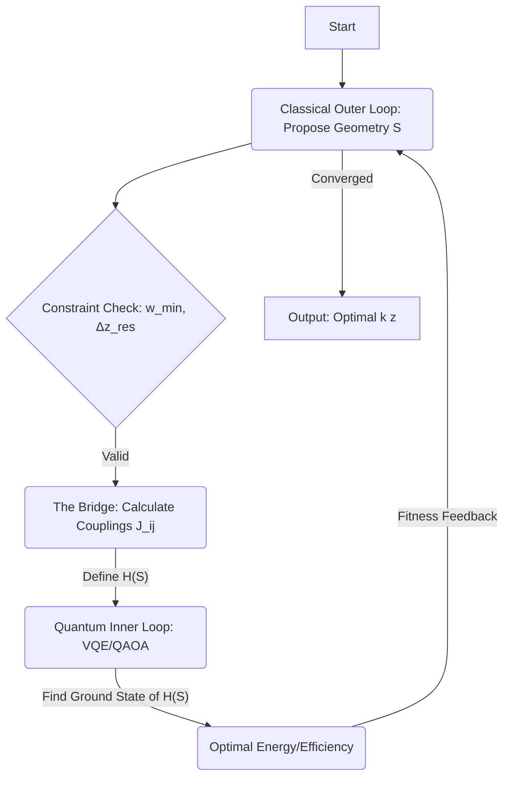

This is a profound and challenging question that strikes at the heart of applying quantum computation to complex engineering design problems. The optimization of a Second-Harmonic Generation (SHG) device structure, with its Fourier-based objective function and strict manufacturing constraints, presents a significant hurdle for classical methods.

Here is a proposal for the most fundamental and powerful way to utilize a quantum computer to solve this design problem, addressing the full scope of the constraints defined in Section 2.

---

### Proposal: Hybrid Quantum-Classical Optimization for SHG Device Design

#### 1. Computational Paradigm

The most effective computational paradigm for this problem is **Hybrid Quantum-Classical Combinatorial Optimization**.

The fundamental insight underpinning this paradigm choice lies in the mathematical structure of the objective function. We aim to optimize the Fourier power spectrum, $|\tilde{\kappa}(k)|^2$. The Fourier transform is a linear operation; therefore, the power spectrum is a **quadratic function** of the spatial structure $\kappa(z)$.

$$ |\tilde{\kappa}(k)|^2 = \mathcal{F}\{\kappa(z)\} \cdot \mathcal{F}^*\{\kappa(z)\} = \sum_{z_1} \sum_{z_2} \kappa(z_1)\kappa(z_2) e^{-ik(z_1-z_2)} $$

When we optimize this function (e.g., maximizing the intensity within the band $K$), the objective remains quadratic. Optimization problems involving a quadratic objective over binary variables (+1/-1 domains) map directly to the **Ising Model** (or equivalently, Quadratic Unconstrained Binary Optimization - QUBO). The Ising Model is the native input format for major quantum optimization algorithms, including Quantum Annealing, the Quantum Approximate Optimization Algorithm (QAOA), and the Variational Quantum Eigensolver (VQE).

However, the constraints of the full search space—particularly the minimum domain width $w_{min}$—are difficult and costly to encode directly into an Ising Hamiltonian.

Therefore, the most powerful approach is a hybrid paradigm that decomposes the problem, leveraging the quantum computer for the quadratic optimization while managing the geometric constraints classically.

#### 2. Encoding into Quantum States

We propose a **Hybrid Decomposition Encoding** strategy. This is vastly superior to a direct spatial encoding (where every resolution element $\Delta z_{res}$ is mapped to a qubit), which would require an excessive number of qubits and make the $w_{min}$ constraint intractable to enforce quantumly.

The key is to recognize that any structure $\kappa(z)$ is defined by two components: (A) the positions of the domain walls, and (B) the signs of the domains.

##### A. Classical Encoding (The Geometry and Constraints)
The positions of the domain walls are managed by the classical processor. A structure with $M$ domains is represented classically as a vector of wall positions: $\mathcal{S} = [z_1, z_2, ..., z_{M-1}]$.

This representation allows the classical algorithm to strictly and efficiently enforce the constraints:
1.  $|z_{i+1} - z_i| \geq w_{min}$ (Minimum domain width).
2.  $z_i$ is an integer multiple of $\Delta z_{res}$ (Minimum control resolution).

##### B. Quantum Encoding (The Signs)
For a *fixed* geometry $\mathcal{S}$ proposed by the classical optimizer, the remaining problem is the optimization of the domain signs. This is encoded on the Quantum Processing Unit (QPU).

*   **Qubits:** We use $M$ qubits, corresponding to the $M$ domains in the structure $\mathcal{S}$.
*   **State:** Each qubit $|q_i\rangle$ represents the sign of the $i$-th domain (e.g., the basis states $|0\rangle$ and $|1\rangle$ map to polarizations $-1$ and $+1$).

**Efficiency:** This encoding is highly efficient. The quantum optimization becomes unconstrained, and the qubit requirement $M$ (number of domains) is typically much smaller than the total number of spatial bins $L/\Delta z_{res}$.

#### 3. Proposal of a Quantum Algorithm

We propose a **Nested Hybrid Variational Optimization** workflow. This iterative process combines a classical search of the geometric space with a quantum optimization of the domain signs.

##### The Workflow

**1. The Classical Outer Loop (Structural Search)**
A classical global optimization algorithm (e.g., a Genetic Algorithm, Bayesian Optimization, or Simulated Annealing) explores the space of valid geometries. It proposes a candidate geometry $\mathcal{S}$ that strictly satisfies the constraints.

**2. The Bridge: Hamiltonian Construction (Classical)**
This is the crucial step where the physics is encoded into the quantum problem. For the fixed geometry $\mathcal{S}$, the objective (maximizing the "flat-top, high-intensity" spectrum in band $K$) is translated exactly into an Ising Hamiltonian $H(\mathcal{S})$:

$$ H(\mathcal{S}) = -\sum_{i=1}^{M} \sum_{j=1}^{M} J_{ij} \sigma_z^{(i)} \sigma_z^{(j)} $$

Here, $\sigma_z^{(i)}$ is the Pauli-Z operator acting on the qubit representing the $i$-th domain. The coupling coefficients $J_{ij}$ represent the interaction between the $i$-th and $j$-th domains as mediated by the Fourier transform.

$J_{ij}$ are calculated classically by integrating the geometric interaction over the frequency band $K$:

$$ J_{ij} \propto \int_{k \in K} \left[ \text{Geometric\_Factors}(\mathcal{S}, k) \right] dk $$

**3. The Quantum Inner Loop (Sign Optimization)**
The QPU is used to find the ground state of the Hamiltonian $H(\mathcal{S})$.

*   **Algorithm:** **VQE** or **QAOA** are employed.
*   **Process:** The quantum algorithm variationally searches the $2^M$ possible sign combinations to find the configuration that minimizes the energy of $H(\mathcal{S})$.
*   **Output:** The ground state corresponds to the optimal sign configuration for geometry $\mathcal{S}$, and the ground state energy corresponds to the optimized conversion efficiency $\eta$.

**4. Feedback and Iteration**
The optimized efficiency (ground state energy) is returned to the Classical Outer Loop as the "fitness" of the geometry $\mathcal{S}$. The classical optimizer uses this fitness to propose new, potentially better geometries, and the process repeats until convergence.

### Summary: Why this is Fundamental and Powerful

This nested hybrid approach represents the most fundamental and powerful strategy for this problem:

1.  **Exploitation of Mathematical Structure:** It recognizes and exploits the quadratic nature of the objective function, mapping the core problem directly to the Ising model, the natural language of quantum optimization.
2.  **Exploration of the Full Search Space:** Unlike the simplified bi-level approach (Section 3), this method explores the *entire* space of valid geometries (Section 2), leveraging the QPU to ensure the optimal signs are found for every geometry considered.
3.  **Exact and Efficient Constraint Handling:** The difficult geometric constraints ($w_{min}$) are handled efficiently and exactly by the classical optimizer. This avoids the need for complex penalty functions or impractically complex quantum circuits that plague other approaches.
4.  **Optimal Resource Allocation:** The QPU is used exclusively for the task where a quantum advantage is most likely: solving the classically hard (NP-hard) Ising model problem.

This is a critical question. The formulation of the objective function, $J$, must precisely capture the design goals (high-intensity and flat-top) while simultaneously adhering to the mathematical constraints required for the proposed quantum optimization paradigm.

The crucial constraint is that for the problem to be efficiently mapped onto an Ising Model or QUBO (required for algorithms like VQE, QAOA, or Quantum Annealing), the objective function **must be quadratic** with respect to the design variables $\kappa(z)$.

### The Challenge of "Flatness"

The "high-intensity" requirement is naturally quadratic, as the power spectrum $|\tilde{\kappa}(k)|^2$ is already a quadratic function of $\kappa(z)$.

However, the "flat-top" requirement is challenging. Intuitively, flatness is measured by minimizing the variance of the spectrum within the band $K$.

$$ \text{Variance} \propto \int_{K} (|\tilde{\kappa}(k)|^2 - I_{avg})^2 dk $$

Since the power spectrum is quadratic, the variance is a **quartic** (fourth-order) function of $\kappa(z)$. Directly optimizing a quartic function is generally beyond the capabilities of current quantum optimization methods.

### Proposed Formulation: Iterative Weighted Power Maximization

The most fundamental and powerful approach is to use a quadratic objective function that maximizes intensity, combined with an iterative classical feedback loop to enforce flatness. This is achieved by maximizing the weighted integrated power within the band.

We define the objective function $J(\kappa)$ to be **minimized** (corresponding to the energy of the quantum Hamiltonian). At iteration $t$:

$$ J_t(\kappa) = - \int_{k \in K} W_t(k) \cdot |\tilde{\kappa}(k)|^2 dk $$

Where:
*   $K$ is the target frequency band.
*   $W_t(k)$ is a positive weighting function at iteration $t$.

### Mathematical Derivation of the Quadratic Form

We must confirm this formulation is quadratic in $\kappa(z)$.

1.  **Expand the Power Spectrum:**
    $$ |\tilde{\kappa}(k)|^2 = \int_{-L/2}^{L/2} \int_{-L/2}^{L/2} \kappa(z_1)\kappa(z_2) e^{-ik(z_1-z_2)} dz_1 dz_2 $$

2.  **Substitute into J(κ):**
    $$ J_t(\kappa) = - \int_{K} W_t(k) \left[ \iint \kappa(z_1)\kappa(z_2) e^{-ik(z_1-z_2)} dz_1 dz_2 \right] dk $$

3.  **Reorder Integration:**
    We switch the order of the spatial and frequency integrals:
    $$ J_t(\kappa) = - \iint \kappa(z_1)\kappa(z_2) \left[ \int_{K} W_t(k) e^{-ik(z_1-z_2)} dk \right] dz_1 dz_2 $$

4.  **Define the Interaction Kernel (Q):**
    The term in the brackets defines the interaction kernel, $Q_t(z_1, z_2)$:
    $$ Q_t(z_1, z_2) = \int_{K} W_t(k) e^{-ik(z_1-z_2)} dk $$

The objective function is now in its canonical quadratic form, suitable for quantum optimization:

$$ J_t(\kappa) = - \iint \kappa(z_1)\kappa(z_2) Q_t(z_1, z_2) dz_1 dz_2 $$

### Addressing the Design Objectives

#### 1. High-Intensity

By minimizing the negative of the integrated power, we directly maximize the total conversion efficiency within the band $K$.

#### 2. Flat-Top (Iterative Spectral Shaping)

The "flat-top" requirement is enforced using the weighting function $W_t(k)$ through an iterative process, sometimes referred to as "water-filling."

While a uniform weight ($W(k)=1$) maximizes total power, the resulting spectrum often exhibits ripples (Gibbs phenomenon) or a domed shape. We use a classical feedback loop to adjust the weights and force flatness:

1.  **Initialization:** Start at $t=0$ with a uniform weight, $W_0(k) = 1$.
2.  **Optimization:** Run the hybrid quantum-classical optimization to minimize $J_t(\kappa)$, yielding an optimal structure $\kappa_{opt}$ and its spectrum $P(k) = |\tilde{\kappa}_{opt}(k)|^2$.
3.  **Weight Update:** Adjust the weights to prioritize spectral regions where the intensity is too low and de-prioritize regions where it is too high. This forces the optimizer to "fill the valleys and flatten the peaks" in the next iteration.

A robust update rule is:

$$ W_{t+1}(k) \propto \frac{1}{P(k) + \epsilon} $$

(Where $\epsilon$ is a small regularization constant).

This iterative strategy allows us to achieve a flat-top profile while ensuring that the core optimization problem solved by the QPU remains strictly quadratic at every step.